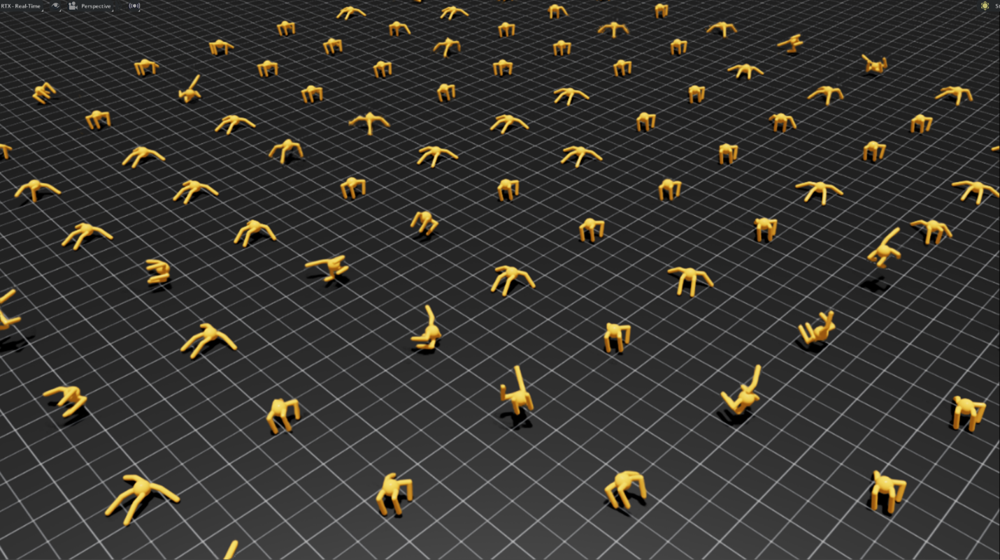

# Evolutionary Computation for Quadruped Robot Control
## Overview
This project implements an evolutionary computation algorithm (MAP-Elites) to train a quadruped robot in simulation. The system uses parallel computation on GPUs to efficiently explore control strategies.

Training is performed in Isaac Lab, enabling large-scale experimentation through high-performance computing (HPC). The goal is to develop robust policies capable of navigating complex environments.
 

## Key Features
* MAP-Elites evolutionary algorithm implementation
* Parallel training on GPU-enabled HPC systems
* Integration with Isaac Lab simulator

## Resources Used
* Python
* Nividia GPU Computing
* Issac Lab / Issac Sim

## Installation
Clone the repository and install dependencies:

1. git clone https://github.com/aswinvktl/MAP-Elites-Group-277.git
2. cd MAP-Elites-Group-277
3. pip install -r requirements.txt

## Usage
### Run Training
Start the evolutionary training process:
     python main.py

This will:
* Initilise the MAP-ELites archive
* Generate and evalue the controller populations
* Run the simulations in issac lab
* Save the results accordingly
* Output data and graphs

### Output
Each run creates a timestamped folder, inside this folder you will find:
* metrics.csv
* archive.json
* visualisation-data/visual_data.csv
* visualisation-data/Scatter_Graph_visual_data.png
* visualisation-data/Heatmap_visual_data.png

At the end of training, a visualisation script is automatically executed.

### Configuration
You can modify key parameters directly in main.py:

MAX_GENERATIONS = 100
POPULATION_SIZE = 250
USE_MOCK = False

## Requirements
* Python 3.x
* NVIDIA GPU + CUDA support
* Isaac Lab / Isaac Sim installed

## Results
### Issac Sim In Progress
This is a screenshot of the Issac sim as it was in progress:

### Visualisation Heatmap
You can see the data we gathered mapped out on this heatmap:

### Visualisation Scatter Graph
You can see the data we gathered mapped out on this scatter graph:

## Future Work
* Deploy controller on physical quadruped robot
* Extend algorithm to diverse terrains and conditions
* Improve training efficiency and robustness

## Team
     Aswin Vazhakkoottathil Podimon (Project Manager)
     David Weir
     Jamie Harris
     Sebastian Murray
     Robbie Black
     Kipras Tomkevicius

## Contacts
     Client: Simon Smith
     Sponsor: Leni Le Goff

## License
MIT